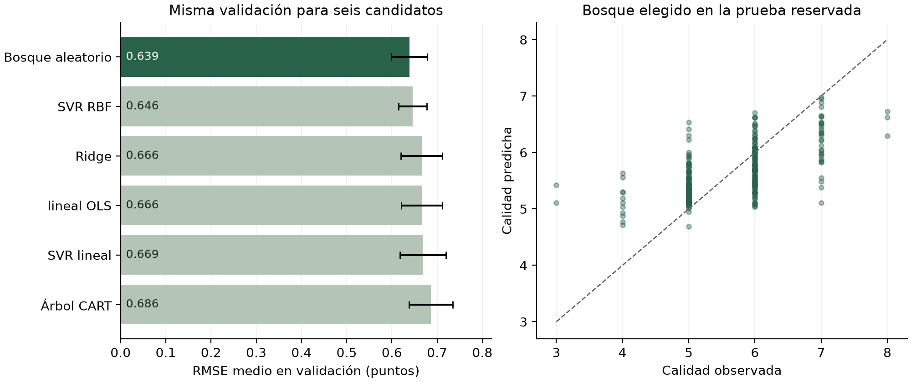

# Calidad del vino tinto

Práctica del Grupo 15 sobre preprocesamiento y selección de modelos. La pregunta es cómo estimar `quality` a partir de once mediciones fisicoquímicas, manteniendo visible la relación entre teoría, código y resultados.

Se comparan seis regresores: OLS, Ridge, CART, bosque aleatorio, SVR lineal y SVR RBF. El predictor que siempre devuelve la media sirve como referencia adicional.

## Leer el trabajo

- [Informe actualizado en Word](docs/reports/Informe%20de%20vinos.docx) y [fuente en Markdown](docs/reports/informe_vinos.md).
- [Lectura de los siete PDF en Word](docs/reports/Lectura%20de%20los%20PDF.docx) y [fuente en Markdown](docs/reports/lectura_pdf.md).
- [Protocolo adoptado](docs/decisions/001-protocolo.md), [arquitectura](docs/arquitectura.md) y [auditoría de coherencia](docs/research/auditoria_coherencia.md).
- [Resultados completos](outputs/02_model_selection/report.json). Descarga y abre [el visor HTML](outputs/02_model_selection/results.html) en tu navegador; GitHub muestra su código fuente.

La lectura completa cubrió seis PDF docentes. El libro de Géron se consultó por secciones de los capítulos 1, 2, 4, 5, 6 y 7. Las páginas exactas están en las notas de investigación. Los PDF y originales aportados se conservan localmente y no se distribuyen aquí.

## Resultado de la iteración 02

Después de quitar 240 repeticiones exactas quedan 1359 observaciones: 1087 de entrenamiento y 272 de prueba. La elección usa cinco folds dentro de entrenamiento y una búsqueda acotada de 43 configuraciones.

| Modelo | RMSE medio de validación |
| --- | ---: |
| Bosque aleatorio | 0.6385 |
| SVR RBF | 0.6464 |
| Ridge | 0.6657 |
| OLS | 0.6659 |
| SVR lineal | 0.6686 |
| CART | 0.6862 |

El bosque elegido obtuvo en prueba **RMSE 0.6364, MAE 0.4934, MSE 0.4050 y R² 0.3963**. La referencia obtuvo RMSE 0.8191. La pequeña diferencia entre bosque y SVR RBF en validación no demuestra superioridad estadística. `quality` es ordinal y se aproxima mediante regresión; esta prueba pertenece al mismo archivo histórico, no a una colección externa nueva.



## Ejecutar

Requiere Python 3.12 o superior y [uv](https://docs.astral.sh/uv/). Las versiones resueltas están en `uv.lock`.

```bash
uv sync --locked --extra dev
uv run wine-quality preprocess --data data/raw/winequality-red.csv
uv run wine-quality select-models --data data/raw/winequality-red.csv
uv run python scripts/build_dashboard.py
```

Abre `outputs/02_model_selection/results.html`. Funciona sin servidor ni conexión. La consola muestra conteos, comparación y métricas finales. El JSON conserva huella del archivo, versiones, parámetros, particiones y predicciones. Los tiempos varían entre equipos.

Para guardar una ejecución separada, utiliza `--output outputs/experimento_nombre` y dirige el visor con `--report` y `--output`. No cambies la semilla buscando una cifra favorable. Al volver a experimentar después de haber observado prueba, documenta que ya se conoce su resultado.

```bash
uv run pytest -q
uv run ruff check src tests scripts
uv run mypy --strict src tests scripts/build_dashboard.py
```

Se comprobaron 21 pruebas, Ruff y mypy estricto. Las pruebas cubren integridad de datos, ausencia de fuga en particiones y escalado, métricas y correspondencia de los modelos con sus ecuaciones.

## Organización

```text
src/wine_quality/
  cases/case_01_preprocessing/    preparación
  cases/case_02_model_selection/  selección
  shared/domain/                 datos y resultados tipados
  shared/ports/                  interfaces pequeñas
  shared/adapters/               Polars y scikit-learn
tests/                           validaciones ejecutables
docs/                            decisiones, lectura e informes
data/raw/                        CSV intacto y atribución
outputs/                         evidencia de ejecución
templates/                       vista HTML de resultados
```

La numeración se conserva con prefijos `case_01` y `case_02`, que son nombres importables por Python. Antes de añadir la etapa 03, lee [cómo extender un caso](docs/arquitectura.md#crear-la-iteración-03) y los archivos `AGENTS.md`. Las explicaciones académicas viven en Markdown; el código usa nombres explícitos y tipos, con una clase por archivo.

## Decisiones y pendientes académicos

El código previo recortaba una tabla distinta de la exportada. En esta iteración conservamos los extremos y documentamos IQR como diagnóstico. Las transformaciones aprendidas se ajustan dentro de cada fold.

La consigna pide una matriz de confusión. Esa parte requiere definir una tarea de clasificación y sigue pendiente; no se simula convirtiendo arbitrariamente predicciones de regresión en clases. COVID permanece como un conjunto separado sin objetivo definido en esta práctica.

El CSV se atribuye a Cortez y colaboradores mediante [UCI Wine Quality](https://archive.ics.uci.edu/dataset/186/wine+quality), con licencia CC BY 4.0. Véase [procedencia y huella](data/README.md). La licencia de ese dataset no se extiende automáticamente al código o al informe del grupo.
