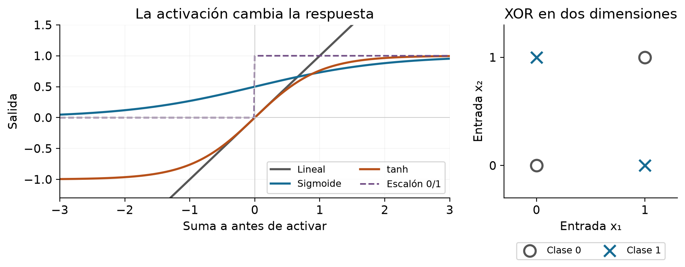

# Guía de estudio de Machine Learning

Conceptos, cuentas y ejercicios para estudiar las diapositivas 1.4 a 1.8 con *Hands-On Machine Learning*, segunda edición, y el proyecto de vinos.

**Cómo usarla.** Lee una explicación, tapa el ejemplo y vuelve a hacerlo con lápiz. Después responde la pregunta de repaso sin mirar. En tus apuntes escribe cuatro cosas: qué problema resuelve la idea, cómo se calcula, qué significa el resultado y qué error debes evitar. El apartado 8 reúne práctica sin resolver y el 9 permite comprobarla.

**Cómo localizar las fuentes.** D1.4, D1.5, D1.6, D1.7 y D1.8 identifican los cinco archivos docentes del mismo número, de Patricia Rodríguez Bilbao. Sus páginas se cuentan desde la portada del PDF. **G** identifica a Aurélien Géron, *Hands-On Machine Learning with Scikit-Learn, Keras, and TensorFlow*, 2.ª edición, O’Reilly, 2019. “G, imp. 69 / PDF 99” significa página 69 impresa en el libro y posición 99 del archivo. La bibliografía final identifica los nombres completos.

**Ruta de lectura.** 1 Fundamentos → 2 Preprocesamiento → 3 Validación → 4 Regresión y clasificación → 5 Árboles y SVM → 6 Redes neuronales → 7 Relación con vinos → 8 Práctica → 9 Respuestas y lecturas del libro. La introducción es explicación de apoyo. El desarrollo principal sigue los temas de las diapositivas disponibles. Las prioridades de repaso se deducen de esos materiales; no constituyen un temario de examen confirmado por la docente.

Los ejemplos marcados **propios** son ejercicios pedagógicos, no resultados experimentales del vino. Los ejercicios del libro se identifican por capítulo, número y página; las soluciones aquí se reconstruyen con nuestro razonamiento. Del libro se consultan las secciones citadas, no se pretende resumir sus 851 páginas.

## 1 Fundamentos para entender lo que sigue

### Qué aprende un modelo

En aprendizaje supervisado tenemos ejemplos con una entrada y una respuesta conocida. Para cada vino, la entrada contiene mediciones como alcohol o acidez; la respuesta es su puntuación de calidad. El algoritmo ajusta una regla con esos pares para estimar la respuesta de otro vino. **Entrenar** cambia parámetros; **predecir** aplica los parámetros aprendidos; **evaluar** compara predicciones con respuestas reales. D1.4, PDF 3–4, presenta registros, características y etiqueta; G, imp. 8–9 / PDF 38–39, distingue clasificación y regresión.

Usaremos m para cantidad de observaciones y p para cantidad de características. X es la tabla de entradas de tamaño m×p; y contiene m respuestas reales. xᵢ es la fila i; ŷᵢ es su predicción. El sombrero indica “estimado”. Una suma Σ significa repetir una operación y sumar sus resultados. En vinos p=11: `quality` va en y, nunca entre las once columnas de X.

**Ejemplo propio.** Si cuatro vinos tienen dos mediciones cada uno, X tiene forma 4×2 e y tiene cuatro valores. Llegan luego tres vinos nuevos: necesitas una tabla 3×2 con las mismas columnas y unidades. Puedes predecir sin conocer sus tres calidades; para medir errores sí necesitas conocerlas.

### Elegir la tarea antes del algoritmo

**Regresión** estima una cantidad: precio, temperatura o puntuación numérica. **Clasificación** elige categorías: gato/no gato o especie de flor. **Aprendizaje no supervisado** busca estructura sin una respuesta objetivo proporcionada: agrupar clientes o resumir dimensiones. La clasificación puede usar etiquetas 0 y 1 sin convertirse en regresión; decide el significado de la salida, no que esté escrita con números. D1.6, PDF 3; G, imp. 8–12 / PDF 38–42.

Un **parámetro** se aprende durante el ajuste, por ejemplo una pendiente. Un **hiperparámetro** configura ese aprendizaje, por ejemplo profundidad máxima del árbol, fuerza de regularización o cantidad de neuronas. G plantea esta distinción en el ejercicio 12 del capítulo 1, imp. 34 / PDF 64. Para resolverlo, pregunta “¿lo estima el ajuste a partir de los datos o lo fijamos para organizar el ajuste?”. Elegir hiperparámetros también puede automatizarse, pero utiliza validación.

La palabra **sesgo** tiene dos usos que separaremos: b como intercepto de una ecuación y sesgo estadístico como error sistemático del procedimiento. Tampoco son iguales “pérdida”, usada para ajustar, y “métrica”, usada para comparar resultados, aunque algunas veces compartan fórmula.

**Para tus apuntes.** Debes poder explicar por qué un modelo con error cero en entrenamiento todavía podría fallar y por qué no le damos `quality` como entrada cuando queremos predecirla. El siguiente bloque prepara esa respuesta.

## 2 Preprocesamiento de datos

### Primero entender el registro y luego corregirlo

D1.4, PDF 5–9, distingue limpieza, transformación y reducción, y presenta datos incompletos, ruidosos e inconsistentes. Limpiar exige saber qué representa cada columna. Un dato raro no demuestra un error. G, imp. 25–27 / PDF 55–57, explica cómo calidad y características irrelevantes dificultan aprender; imp. 62–64 / PDF 92–94, convierte las correcciones en transformaciones reproducibles.

**Ejercicio resuelto sobre D1.4, PDF 9.** La tabla de personas contiene identificadores repetidos, celdas vacías y formatos distintos. Así se razona antes de borrar:

| Observación | Decisión razonada |
| --- | --- |
| Identificador 555 aparece para personas diferentes | Investigar la clave. Repetir un identificador no hace idénticas las filas. |
| Ciudad vacía | Es un faltante. Recuperar de una fuente fiable o aplicar una regla de imputación justificada. |
| Fecha escrita en otro formato | Interpretar y normalizar el formato; una fecha ISO no es inválida por ser distinta. |
| País escrito donde corresponde ciudad | Revisar el campo y la fuente; no adivinar una ciudad. |
| Código de género A | Consultar el diccionario de códigos antes de declararlo inválido. |
| Persona no docente con estudiantes asignados | Comprobar la regla de negocio; el significado de las columnas determina si hay contradicción. |

**Faltantes, ejemplo propio.** Si los valores conocidos de entrenamiento son 2, 3 y 9, su mediana es 3. Esa mediana rellena faltantes en entrenamiento y después en validación/prueba. No recalcules otra mediana usando la prueba: introducirías información del conjunto reservado. Es precisamente la separación que hace G, imp. 63 / PDF 93.

**Extremos, ejemplo propio.** Dados Q1=2 y Q3=5, el rango intercuartílico IQR=Q3−Q1=3. La regla diagnóstica Q1−1.5×IQR a Q3+1.5×IQR produce límites −2.5 y 9.5. Un valor 10 queda señalado. Falta investigar si es error o un caso real: el cálculo no autoriza eliminarlo. Esta es una ampliación didáctica para entender la revisión de extremos del proyecto.

### Escalar cambia las unidades de cálculo

D1.4, PDF 10, incluye codificación, normalización y construcción de características. G, imp. 69–70 / PDF 99–100, distingue min–max y estandarización. Para una columna x, μ es su media de entrenamiento y s su desviación estándar. La entrada transformada u indica cuántas desviaciones se aleja del promedio:

$$u=\frac{x-\mu}{s}.$$

**Ejemplo propio paso a paso.** Entrenamiento: 8, 10 y 12. Primero μ=(8+10+12)/3=10. Después s²=[(8−10)²+(10−10)²+(12−10)²]/3=8/3 y s≈1.633. Aquí dividimos por m, como el escalador del proyecto. Para un nuevo valor 14, u=(14−10)/1.633≈2.449. Un valor estandarizado puede superar 1; no es una probabilidad.

Min–max usa los extremos del entrenamiento: (x−mínimo)/(máximo−mínimo). En el mismo ejemplo, 14 se transforma en (14−8)/(12−8)=1.5. El intervalo [0,1] describe el rango observado al ajustar, no garantiza que todo dato futuro caiga dentro. Una columna constante requiere tratamiento específico porque su rango o desviación es cero.

**Contraste con la diapositiva.** D1.4, PDF 5, asocia normalización y reducción del ruido. Escalar por sí solo no corrige una medición errónea ni vuelve normal una distribución: cambia su representación. Es importante en modelos que usan distancias o penalizan pesos. Los árboles comparan orden y umbrales, por eso normalmente no necesitan esta escala. G, imp. 69–70, 154 y 177 / PDF 99–100, 184 y 207.

Para categorías sin orden, codificar rojo=1, blanco=2 y rosado=3 introduciría una distancia artificial en ciertos modelos. One-hot crea una columna indicadora por categoría. Dividir habitaciones entre hogares, en cambio, crea una característica con interpretación. G desarrolla ambas ideas en imp. 61–67 / PDF 91–97. D1.4, PDF 10, también menciona representaciones de texto e imágenes: transformar información en números útiles es distinto de “limpiar” una tabla; no necesitas implementar BERT para este CSV.

### Seleccionar características sin contaminar la evaluación

| Método de D1.4 | Qué hace | Qué debes entender |
| --- | --- | --- |
| Filtro, PDF 12 | Puntúa asociación: Pearson, chi-cuadrado o información mutua | No entrena el predictor para cada subconjunto. Una relación no lineal puede escapar a Pearson. |
| Wrapper, PDF 13 | Usa un predictor para evaluar subconjuntos; RFE elimina características de forma recursiva | Requiere ajustes repetidos y depende del modelo utilizado. |
| Integrado, PDF 14 | La selección o reducción de pesos ocurre al entrenar | Lasso puede anular pesos; Ridge suele encogerlos sin eliminarlos. |

Un filtro sigue aprendiendo del entrenamiento, aunque sea más barato. Si seleccionas columnas con todas las respuestas antes de validar, las respuestas reservadas influyen en el resultado. G, imp. 70–71 / PDF 100–101, muestra cómo encadenar transformaciones; el ejercicio 3 del capítulo 2, imp. 84 / PDF 114, propone añadir selección dentro de la preparación. El lugar coherente es dentro del pipeline que se ajusta en cada fold.

**Ejemplo propio de límite del filtro.** En x=[−1,0,1] e y=[1,0,1], la correlación lineal es cero, pero y=x² exactamente. “Pearson bajo” no significa “sin relación”. Chi-cuadrado tampoco es una receta universal para cualquier columna: exige una representación compatible con el contraste; no se aplica indiscriminadamente a variables estandarizadas negativas.

**Apunte final del bloque.** La figura de tiempos de D1.4, PDF 6, cita una encuesta de 2016, no una proporción universal de cualquier proyecto. D1.4, PDF 15–16, cierra con construcción, prueba, despliegue y seguimiento: también importan interpretabilidad y costo de predecir. G, imp. 80–83 / PDF 110–113, explica por qué el trabajo sigue después de entrenar.

## 3 Validación y métricas

### Separar aprender elegir y comprobar

D1.5, PDF 2–4, pide buen comportamiento en ejemplos nuevos. G, imp. 30–32 / PDF 60–62, distingue entrenamiento, validación y prueba: el entrenamiento aprende parámetros; la validación ayuda a elegir configuraciones; la prueba estima el comportamiento de la elección terminada. Consultar repetidamente la prueba para cambiar el modelo hace que deje de ser una comprobación independiente.

**Ejemplo propio de validación cruzada.** Tenemos 20 registros y reservamos 4 de prueba. Dividimos los 16 restantes en cuatro grupos de 4. En cada vuelta entrenamos con 12 y validamos con los otros 4; al rotar, cada grupo valida una vez. El escalador se ajusta de nuevo con los 12 de cada vuelta. Luego elegimos configuración, ajustamos con los 16 y evaluamos los 4 de prueba. G, imp. 73–74 / PDF 103–104, enseña esta rotación; nuestro proyecto utiliza cinco folds, no los cuatro de este ejemplo.

### Subajuste sobreajuste sesgo y varianza

**Subajuste:** el modelo no representa suficientemente el patrón; suelen ser altos tanto error de entrenamiento como de validación. **Sobreajuste:** se adapta a detalles del entrenamiento que no se repiten; aparece una brecha entre entrenamiento bueno y validación peor. Antes de culpar a la capacidad, revisa también errores de datos, optimización y cambios de población. D1.5, PDF 3–7; G, imp. 27–30 y 134 / PDF 57–60 y 164.

Las dianas de D1.5, PDF 5–6, se entienden imaginando que entrenamos varias veces con muestras distintas y predecimos el mismo caso. Predicciones agrupadas lejos de su valor esperado sugieren sesgo alto. Predicciones que cambian mucho con la muestra sugieren varianza alta. Ni la varianza es “el error de un vino” ni el sesgo estadístico es el parámetro b de una neurona.

**La fórmula tiene condiciones.** Sea f(x) la respuesta media real en una entrada fija x, ŷ_D(x) la predicción aprendida del conjunto D y ε un ruido de media cero e independiente de D, con varianza σ². Promediando sobre posibles conjuntos de entrenamiento y ruido:

$$\mathbb E[(y-\hat y_D(x))^2]=(\mathbb E_D[\hat y_D(x)]-f(x))^2+\operatorname{Var}_D(\hat y_D(x))+\sigma^2.$$

El primer término es sesgo al cuadrado, el segundo variación entre ajustes y el tercero ruido irreducible con esas entradas. La fórmula desarrolla la intuición de D1.5, PDF 5, y G, imp. 134 / PDF 164. No se calculan sus tres partes a partir de un único residuo. La curva en U de la lámina 7 es una ilustración de la compensación, no una forma garantizada para cualquier experimento.

**Ejercicio del libro resuelto.** Capítulo 4, ejercicio 9, G imp. 152 / PDF 182: Ridge tiene errores altos y parecidos en entrenamiento y validación. Primero identificamos subajuste, compatible con sesgo alto. Si la penalización está restringiendo demasiado, probaríamos reducirla y compararíamos por validación. No aumentarla automáticamente “para evitar sobreajuste”, porque la observación no muestra ese patrón.

### Métricas de regresión con una cuenta completa

Sea eᵢ=yᵢ−ŷᵢ el residuo, m la cantidad evaluada y ȳ la media de las respuestas reales de ese conjunto. D1.5, PDF 8, presenta MAE, MSE y R²; G, imp. 39–41 / PDF 69–71, desarrolla RMSE y MAE.

$$\mathrm{MAE}=\frac{1}{m}\sum_i|e_i|,\qquad \mathrm{MSE}=\frac{1}{m}\sum_i e_i^2,\qquad \mathrm{RMSE}=\sqrt{\mathrm{MSE}}.$$

$$R^2=1-\frac{\sum_i e_i^2}{\sum_i(y_i-\bar y)^2}.$$

**Ejemplo propio.** y=[5,6,7], ŷ=[5.5,5.5,6.5]. Los residuos son [−0.5,0.5,0.5]. Su suma sería 0.5, pero permitir compensaciones oculta magnitudes; por eso usamos absolutos o cuadrados. MAE=(0.5+0.5+0.5)/3=0.5. MSE=(0.25+0.25+0.25)/3=0.25. RMSE=√0.25=0.5. Como ȳ=6, la suma total de cuadrados es 1+0+1=2; R²=1−0.75/2=0.625.

MAE y RMSE están en puntos de calidad; MSE, en puntos al cuadrado. R² compara con la media del conjunto evaluado: no significa 62.5 % de vinos acertados. Puede ser negativo; su expresión matemática es indefinida si todas las respuestas reales son iguales. La media del denominador de R² no debe confundirse con nuestro predictor de referencia, que aprende la media de entrenamiento.

### Clasificación y la matriz de confusión

D1.5, PDF 9–11, cambia de tarea: ahora hay clases. Primero fija cuál es la clase positiva. Usaremos “gato”. Las filas siguientes son realidad y las columnas predicción. La orientación debe leerse, no memorizarse por posición; G, imp. 90–92 / PDF 120–122, utiliza el mismo criterio de filas/columnas, pero ordena primero la clase negativa.

| Realidad / Predicción | Gato | No gato |
| --- | --- | --- |
| Gato | TP=140 | FN=30 |
| No gato | FP=20 | TN=10 |

**Reconstrucción de D1.5, PDF 11.** Hay 200 casos, 170 gatos reales y 160 predichos como gato. La intersección de 140 la aporta la matriz; no se deduce de los dos totales solos. TP es gato reconocido; FN es gato que pasó por no gato; FP es no gato anunciado como gato; TN es no gato reconocido. El texto de la lámina 9 intercambia o repite algunas siglas; estas definiciones corresponden a la tabla y al libro.

| Métrica | Cálculo en el ejemplo | Pregunta que contesta |
| --- | --- | --- |
| Accuracy o exactitud | (140+10)/200=0.75 | ¿Qué proporción total acertó? |
| Tasa de error | (20+30)/200=0.25 | ¿Qué proporción total falló? |
| Precision | 140/(140+20)=0.875 | De los anunciados como gato, ¿cuántos lo eran? |
| Recall o sensibilidad | 140/(140+30)≈0.8235 | De los gatos reales, ¿cuántos detectó? |
| Especificidad | 10/(10+20)≈0.3333 | De los no gatos reales, ¿cuántos reconoció? |
| F1 | 2×140/(2×140+20+30)≈0.8485 | ¿Cómo se combinan precision y recall? |

**No confundir precision y accuracy.** En español pueden traducirse de forma ambigua; escribe la fórmula y el denominador. Tampoco confundir ninguna de ellas con R². Un sistema que dijera “gato” siempre tendría accuracy=170/200=0.85, mayor que 0.75, pero especificidad cero. Así se ve por qué importa el tipo de fallo. G, imp. 89–94 / PDF 119–124, desarrolla este problema y el efecto del umbral.

Para Fβ, P es precision, R es recall y β>0 controla su ponderación. La forma correcta es:

$$F_\beta=\frac{(1+\beta^2)PR}{\beta^2P+R}.$$

D1.5, PDF 10, muestra 1+β en el numerador; debe ser **1+β²**. Con β=1 coincide con F1; con β=2 se da más peso a recall. En nuestra matriz F2=700/(700+120+20)=0.8333. G desarrolla F1 en imp. 92 / PDF 122; para la generalización y la corrección de Fβ se contrastó la [documentación oficial de scikit-learn](https://scikit-learn.org/stable/modules/generated/sklearn.metrics.fbeta_score.html), consultada el 29-09-2026.

**Para tus apuntes.** Antes de calcular: tarea → conjunto evaluado → definición del error → denominador. Cambiar cualquiera de esos cuatro elementos cambia la interpretación.

## 4 Regresión lineal regularización y clasificación

### Separar la ecuación de predicción del procedimiento de ajuste

D1.6, PDF 4–5, presenta una relación lineal simple o múltiple. Con p entradas, wⱼ es el peso de la entrada j y b el intercepto. El producto wᵀx es una abreviatura de sumar cada entrada multiplicada por su peso. G, imp. 112–114 / PDF 142–144, separa predicción y función de costo:

$$\hat y=b+\sum_{j=1}^{p}w_jx_j,\qquad J(b,w)=\frac{1}{2m}\sum_{i=1}^{m}(\hat y_i-y_i)^2.$$

La primera expresión produce una respuesta. La segunda mide qué tan mal predice un conjunto de pesos sobre m ejemplos. **Ajustar** es buscar b y w que reduzcan J. El factor 1/2 simplifica derivadas; multiplicar toda la pérdida por una constante positiva no cambia dónde está su mínimo.

**Ejemplo propio de predicción.** b=5.6, pesos [0.3,−0.2] y entradas estandarizadas [1,0.5] producen 5.6+0.3×1−0.2×0.5=5.8. No significa que aumentar alcohol cause exactamente ese cambio: el coeficiente es una relación dentro del modelo, manteniendo las otras entradas fijas.

**Cómo se resuelven mínimos cuadrados.** Una biblioteca puede usar álgebra numérica para obtener el ajuste; otra puede aproximarlo con descenso de gradiente. No son modelos distintos por esa sola diferencia. G, imp. 114–117 / PDF 144–147, desarrolla ecuación normal y pseudoinversa. `LinearRegression` del proyecto resuelve mínimos cuadrados; el siguiente ejercicio enseña optimización y no pretende describir su implementación interna.

D1.6, PDF 5, enlaza errores con normalidad y el teorema del límite central. OLS puede calcularse sin asumir errores normales. Para interpretarlo además como máxima verosimilitud gaussiana se suponen errores normales independientes con varianza común; no basta decir “intervienen muchos factores”. Esta precisión separa la definición del método de una justificación probabilística adicional.

### Descenso de gradiente sin saltarse la derivada

Una derivada indica cómo cambia J al cambiar ligeramente un parámetro. El gradiente reúne esas derivadas. Si la derivada respecto de w es positiva, subir w aumenta localmente J, por eso nos movemos en sentido contrario. η>0 es la tasa de aprendizaje. Para una entrada por ejemplo:

$$\frac{\partial J}{\partial w}=\frac{1}{m}\sum_i(\hat y_i-y_i)x_i,\qquad \frac{\partial J}{\partial b}=\frac{1}{m}\sum_i(\hat y_i-y_i).$$

El 2 de derivar el cuadrado cancela el 1/2; derivar wx+b respecto de w aporta x y respecto de b aporta 1. Luego w nuevo=w−η∂J/∂w y b nuevo=b−η∂J/∂b. Las derivadas se calculan con el mismo estado anterior. G, imp. 118–123 / PDF 148–153, desarrolla tasa, escala y gradiente por lote.

**Ejemplo propio de una actualización.** x=[1,2], y=[2,3], w=0, b=0 y η=0.1. Primero ŷ=[0,0] y J=(4+9)/4=3.25. Después ∂J/∂w=[(−2)×1+(−3)×2]/2=−4; ∂J/∂b=(−2−3)/2=−2.5. Actualizamos w=0.4 y b=0.25. Las nuevas predicciones son [0.65,1.05] y J=(1.35²+1.95²)/4=1.40625. Disminuyó, pero una sola actualización no demuestra haber llegado al mínimo. Una tasa excesiva puede aumentar la pérdida.

**Batch** usa todo el entrenamiento para un paso; **estocástico**, una observación; **mini-batch**, un grupo pequeño. Una **época** recorre una vez el conjunto. G, imp. 124–128 / PDF 154–158. Una época puede contener muchas actualizaciones.

### Polinomios y regularización

D1.6, PDF 6, permite agregar x², x³ y otras potencias. En ŷ=b+w₁x+w₂x², la curva es no lineal en x, pero sigue siendo lineal en los coeficientes aprendidos. Para x=2, b=1, w₁=2 y w₂=0.5, la predicción es 1+4+2=7. Aumentar el grado aumenta posibilidades de ajuste y también de sobreajuste; debe comprobarse por validación. G, imp. 129–134 / PDF 159–164.

D1.6, PDF 7, agrega un costo por pesos grandes. Conservamos J anterior y usamos λ≥0 para la intensidad de penalización; el intercepto b queda fuera:

$$J_{L2}=J+\lambda\sum_jw_j^2,\qquad J_{L1}=J+\lambda\sum_j|w_j|.$$

**L2, Ridge:** encoge pesos. **L1, Lasso:** puede hacer algunos exactamente cero, de ahí su relación con selección de variables. Lasso penaliza valores absolutos de los **pesos**; no reemplaza automáticamente la pérdida cuadrática por MAE. D1.4, PDF 14; D1.6, PDF 7; G, imp. 135–139 / PDF 165–169.

**Ejemplo propio.** Dos candidatos tienen SSE=10 con w=4 y SSE=12 con w=1. Bajo el objetivo SSE+αw², con α=1, cuestan 26 y 13. Se prefiere el segundo aunque ajuste peor esos datos: se paga error a cambio de un peso menor. Que mejore en datos nuevos todavía debe validarse. Escalar importa porque cambiar unidades cambia la magnitud de los pesos penalizados.

**Cuidado con la notación.** La convención del proyecto para Ridge es SSE+α∑w². Multiplicando nuestra expresión J con L2 por 2m se obtiene α=2mλ. Por eso no se copian valores numéricos de regularización entre fórmulas con normalizaciones distintas. G, ecuación 4-8, imp. 135 / PDF 165, utiliza MSE+(α/2)∑w²: en esa convención α del código sería m×α del libro/2. El significado “más penalización” se conserva; la escala del número cambia.

### Regresión logística y softmax

D1.6, PDF 8–9, pasa a **clasificación binaria**, pese al nombre “regresión logística”. Primero calcula un score a=b+wᵀx; la función sigmoide lo convierte en una probabilidad estimada q de pertenecer a la clase 1. Con umbral 0.5 predice 1 cuando q≥0.5. G, imp. 142–144 / PDF 172–174:

$$q=\sigma(a)=\frac{1}{1+e^{-a}}.$$

**Ejemplo propio.** a=ln(4)≈1.3863 produce q=1/(1+1/4)=0.8. El modelo estima 80 % para la clase positiva; no prueba que este caso esté bien clasificado. Para y real 0 o 1, la probabilidad asignada al resultado observado puede escribirse qʸ(1−q)¹⁻ʸ: con y=1 queda q; con y=0 queda 1−q. Tomar su logaritmo negativo produce:

$$L=-[y\ln q+(1-y)\ln(1-q)].$$

Si y=1 y q=0.8, L=−ln(0.8)≈0.2231; si y=0, L=−ln(0.2)≈1.6094. La misma confianza recibe más castigo cuando apunta a la clase equivocada. Al promediar L sobre los ejemplos obtenemos log loss. Esta reconstrucción explica el costo de G, imp. 144 / PDF 174. La sigmoide curva la probabilidad, pero el límite q=0.5 equivale a a=0: con entradas originales lineales, la frontera sigue siendo lineal.

**Softmax**, D1.6, PDF 10–12, generaliza a K clases mutuamente excluyentes. Cada clase k recibe un score sₖ=bₖ+wₖᵀx. Se exponencian y se dividen por su suma para obtener probabilidades positivas que suman uno. G, imp. 148–150 / PDF 178–180:

$$q_k=\frac{e^{s_k}}{\sum_{j=1}^{K}e^{s_j}}.$$

**Ejemplo propio.** Scores [ln(1),ln(2),ln(3)] dan exponenciales [1,2,3] y probabilidades [1/6,2/6,3/6]. Gana la tercera clase. Si la clase real era la segunda, su pérdida es −ln(2/6)≈1.0986. No se exige que la clase ganadora supere 50 %: [0.4,0.35,0.25] también permite elegir la primera. D1.6, PDF 12, ilustra una fruta con probabilidad 0.68; es una estimación, no certeza.

**Ejercicio del libro resuelto.** Capítulo 4, ejercicio 11, G imp. 152 / PDF 182: interior/exterior y día/noche son dos decisiones simultáneas. Una imagen puede ser exterior y nocturna. Podemos usar dos clasificadores binarios, porque no estamos eligiendo exactamente una entre las cuatro palabras. Un softmax sobre esas cuatro palabras las trataría erróneamente como excluyentes. Otra tarea distinta podría definir cuatro combinaciones como clases, pero esa ya sería otra representación del objetivo.

## 5 Árboles y máquinas de soporte vectorial

### Cómo decide un árbol

D1.7, PDF 3–4, presenta raíz, nodos internos, ramas y hojas. En cada nodo se pregunta por una característica; la respuesta decide por qué rama continuar. Llegar a una hoja termina la predicción. La lámina 4 nombra ID3, C4.5 y CART como algoritmos de construcción; el procedimiento desarrollado aquí es la partición binaria de CART explicada por G, imp. 175–180 / PDF 205–210.

**Lectura del ejemplo docente, D1.7, PDF 7.** En la raíz se pregunta por reembolso. La rama “sí” lleva a una hoja “No”; la rama “no” examina estado civil. Un caso sin reembolso, divorciado y con ingreso 95K sigue hasta la rama mayor a 80K y acaba en “Sí”. Esta cuenta sigue el dibujo: no hemos entrenado un árbol nuevo. Al programar hay que cubrir también la igualdad del umbral, por ejemplo ≤80K y >80K.

La cuestión de entrenamiento es **qué pregunta separa mejor los casos**. Para clasificación, pₖ es la fracción de clase k en un nodo. Gini y entropía miden mezcla; valen cero cuando todos pertenecen a una clase. D1.7, PDF 5; G, imp. 177–181 / PDF 207–211:

$$G=1-\sum_kp_k^2,\qquad H=-\sum_kp_k\log_2p_k.$$

En entropía se toma 0×log₂0 como cero por su límite. Para dos hijos, nL y nR son sus tamaños y n=nL+nR. Se compara la impureza ponderada (nL/n)GL+(nR/n)GR: una hoja de dos casos no pesa lo mismo que otra de doscientos. La ganancia es impureza del padre menos esa mezcla ponderada.

**Ejemplo propio resuelto.** Padre: 6 positivos y 4 negativos; G=1−0.6²−0.4²=0.48. Una división crea izquierda con 4 positivos y 0 negativos, G=0; derecha con 2 positivos y 4 negativos, G=1−(2/6)²−(4/6)²=4/9. Impureza final=(4/10)×0+(6/10)×4/9≈0.2667. Ganancia≈0.2133. Con entropía: H del padre≈0.9710, H derecho≈0.9183 y H final≈0.5510; ganancia≈0.4200 bits. Se compararían otras divisiones usando el mismo criterio.

D1.7, PDF 6, distingue detener crecimiento y podar posteriormente. Una profundidad limitada o un mínimo de ejemplos por hoja restringen memorizar accidentes. G, imp. 181–184 / PDF 211–214. **Ejercicio del libro 3, capítulo 6, imp. 186 / PDF 216:** ante sobreajuste, reducir la profundidad máxima es una prueba razonable porque reduce la capacidad; luego debemos medir validación.

### El puente hacia regresión y bosques

Las láminas ilustran categorías. En vinos necesitamos números. G, imp. 183–184 / PDF 213–214, explica que una hoja regresora predice la media y se divide por reducción del error cuadrático. **No usamos Gini para nuestra calidad numérica.**

¿Por qué la media? Para una hoja de n respuestas y una predicción constante c, queremos minimizar S(c)=∑(yᵢ−c)². Derivar da S′(c)=2nc−2∑yᵢ. Igualar a cero produce c=∑yᵢ/n; la segunda derivada 2n es positiva. En una hoja [5,5,7], la predicción es 17/3≈5.6667. No es necesariamente una de las respuestas observadas.

Un **bosque aleatorio** promedia predicciones de árboles diversos, entrenados con aleatoriedad en muestras y candidatos de características. La diversidad reduce cuánto depende la predicción de una sola partición, aunque no elimina todo error. Es un complemento del proyecto apoyado en G, imp. 193–194 y 197–198 / PDF 223–224 y 227–228. Si tres árboles predicen 5, 6 y 7, el bosque regresor devuelve 6; no vota una clase.

### SVM margen y vectores de soporte

D1.7, PDF 8–11, plantea separar clases dejando un margen amplio. Entre varias rectas que clasifican los ejemplos, interesa una que deje espacio respecto de los puntos críticos. Esos puntos influyen en la solución y se llaman vectores de soporte. Con margen suave pueden estar dentro del margen e incluso mal clasificados; no todos están exactamente sobre dos líneas. G, imp. 153–156 / PDF 183–186.

Para mostrar el sentido del margen, usemos una dimensión: negativos en x=−2 y x=−1, positivos en x=1 y x=2. La frontera x=0 deja igual distancia a los más cercanos, −1 y 1. Una frontera x=0.8 todavía clasifica todos, pero deja al positivo en 1 demasiado cerca. El margen aporta un criterio que “cero errores” no distinguía. Es un ejemplo propio.

**Margen duro** exige separación sin infracciones; puede ser inviable o sensible a extremos. **Margen suave** permite infracciones penalizadas. C controla cuánto pesan: C mayor penaliza más las infracciones; C menor permite más a cambio de regularizar. G, imp. 155–156 / PDF 185–186. La escala de las entradas cambia distancias y margen, por eso debe controlarse.

### Kernels y SVR

D1.7, PDF 12–13, propone cambiar la representación cuando una recta no basta. Un kernel calcula productos internos de una representación transformada sin construirla explícitamente. La lámina nombra lineal, polinomial, gaussiano y sigmoide. G, imp. 157–161 y 170–172 / PDF 187–191 y 200–202, explica el paso desde nuevas características al truco del kernel. La transformación no garantiza resolver cualquier etiquetado: dos entradas idénticas con etiquetas contradictorias siguen planteando un conflicto.

El lineal conserva productos de entradas; el polinomial permite interacciones; RBF o gaussiano expresa cercanía; el sigmoide utiliza una función tipo tanh. No debe confundirse “kernel sigmoide” con un clasificador logístico ni con una probabilidad. En RBF, u y v son vectores escalados y γ>0 controla qué tan rápido decae la similitud:

$$K(u,v)=\exp(-\gamma\lVert u-v\rVert^2).$$

**Ejemplo propio.** u=[0,0], v=[1,0]: distancia al cuadrado=1. Con γ=0.5, K=exp(−0.5)≈0.6065. Con γ=2, K=exp(−2)≈0.1353. Un γ mayor hace más local la influencia. No cambia las distancias originales: cambia cuánto pesan dentro de la comparación.

**SVR es el puente a regresión.** En vez de separar etiquetas, busca una función con una banda de tolerancia ε alrededor de la predicción. Con residuo e=y−ŷ:

$$L_\epsilon(e)=\max(0,|e|-\epsilon).$$

Si y=6, ŷ=5.7 y ε=0.1, la pérdida es 0.3−0.1=0.2. Si ŷ=5.95, es cero. No quiere decir que el segundo error real sea cero: significa que no paga pérdida dentro de la tolerancia. G, imp. 162–164 / PDF 192–194. En vinos comparamos SVR lineal y SVR RBF; las diapositivas por sí solas explican SVM clasificador, no ese cambio de tarea.

**Ejercicio del libro resuelto.** Capítulo 5, ejercicio 6, G imp. 174 / PDF 204: una SVM RBF subajusta. Aumentar γ puede permitir fronteras más locales; aumentar C puede penalizar más las infracciones. Son hipótesis para validar, no una promesa de mejora. Si sobreajusta, suele explorarse la dirección opuesta.

## 6 Redes neuronales desde una neurona hasta backpropagation

### Tres palabras que cumplen funciones distintas

D1.8, PDF 3–5 y 8, presenta representaciones y capas. **MLP o perceptrón multicapa** es la estructura de una red con capas ocultas. **Feedforward** describe el flujo de entradas a salidas sin realimentación en ese recorrido. **Backpropagation** calcula derivadas recorriendo las dependencias hacia atrás; el optimizador usa esas derivadas para cambiar parámetros. No son tres modelos que debamos escoger por separado. G, imp. 289–291 / PDF 319–321.

La comparación entre ML y deep learning en D1.8, PDF 3–4, simplifica tendencias. Una red pequeña puede trabajar en CPU; más capas o más datos no garantizan mejores resultados. En vinos ya disponemos de once mediciones y usamos una sola capa oculta. G, imp. 289 y 323–324 / PDF 319 y 353–354, relaciona profundidad con estructura y complejidad del problema.

### Qué calcula una neurona y para qué sirve la activación

D1.8, PDF 6, suma entradas ponderadas y resta un umbral. Escribiremos a=∑wⱼxⱼ+b y h=φ(a). El símbolo φ representa la función de activación. Restar un umbral t equivale a sumar b=−t. Los nodos constantes −1 de la lámina 8 representan umbrales, no nuevas mediciones del vino.

**Ejemplo propio.** x=[2,1], w=[0.5,−0.2], b=0.1: a=2×0.5−0.2+0.1=0.9. La salida depende ahora de φ. Lineal devuelve 0.9; sigmoide devuelve aproximadamente 0.7109; tanh, aproximadamente 0.7163. La suma y la activación son operaciones distintas.

D1.8, PDF 7, presenta identidad, escalón, sigmoide y tanh. El escalón produce una decisión brusca; sigmoide queda entre 0 y 1; tanh entre −1 y 1. El escalón tiene derivada cero fuera del salto y no es derivable en él: no ofrece una señal útil para el descenso ordinario. G, imp. 291–292 / PDF 321–322, explica por qué se introdujeron activaciones suaves y también presenta ReLU, max(0,a).

**Figura propia.** A la izquierda, las funciones reciben la misma suma a pero producen salidas distintas. A la derecha, XOR exige separar diagonales opuestas; una sola recta no basta. Conceptos contrastados con D1.8, PDF 7 y 17; G, imp. 288 y 291–292 / PDF 318 y 321–322.

Sin activación no lineal, apilar capas no añade esa capacidad: si h=2x+1 e ŷ=3h−4, sustituyendo obtenemos ŷ=6x−1, otra recta. La capa oculta debe hacer algo más que otra suma lineal. Para tanh, si h=tanh(a), su derivada es 1−h². Cerca de h=±1 vale poco: la activación se satura y transmite gradientes pequeños. G, imp. 291–292 / PDF 321–322.

### Del error a una corrección del peso

D1.8, PDF 9, introduce la idea de Hebb, refuerzo por coactivación. Es contexto histórico; la regla supervisada que estudiamos después utiliza el error respecto de una respuesta real. En las láminas 10–14, X indica entradas, Z objetivos y Y salidas. Aquí mantenemos y real, ŷ predicha y U para entradas estandarizadas, evitando que Z signifique dos cosas.

Empezamos con una sola salida lineal ŷ=wx+b. Para una observación conocida y, usamos E=(ŷ−y)²/2. Por la regla de la cadena, derivar E respecto de w exige multiplicar “cambio de E al cambiar ŷ” por “cambio de ŷ al cambiar w”:

$$\frac{\partial E}{\partial w}=\frac{\partial E}{\partial\hat y}\frac{\partial\hat y}{\partial w}=(\hat y-y)x.$$

Por eso w nuevo=w−η(ŷ−y)x también se escribe w+η(y−ŷ)x. Es la conexión con la regla delta de D1.8, PDF 12. **Si ŷ=φ(a) es no lineal, aparece además φ′(a).** Omitirla solo es correcto bajo condiciones como salida lineal en esta pérdida; no memorices la versión abreviada como universal. G, imp. 290–291 / PDF 320–321, fundamenta la propagación por derivadas.

### Una actualización completa de una red pequeña

Este ejercicio propio usa una red 2→1→1, sin regularización, para ver cada cuenta. Entradas x₁=1, x₂=0.5. Pesos de entrada w₁=0.2, w₂=0.4; sesgo oculto b=0.1. Peso hacia la salida v=0.6; sesgo final c=0.1. Objetivo y=0.8 y tasa η=0.1. La neurona oculta usa tanh; la salida es lineal.

**1. Avance.** a=w₁x₁+w₂x₂+b=0.5. h=tanh(0.5)≈0.462117. ŷ=vh+c≈0.377270. E=(0.377270−0.8)²/2≈0.089350.

**2. Señal de salida.** δₒ=∂E/∂ŷ=ŷ−y≈−0.422730. Es negativa: aumentar la salida un poco reduciría el error.

**3. Señal oculta.** No conocemos una “etiqueta correcta” para h. La lámina 13 marca esa dificultad. Para saber cómo contribuye su suma a al error, encadenamos tres derivadas:

$$\delta_h=\frac{\partial E}{\partial a}=\frac{\partial E}{\partial\hat y}\frac{\partial\hat y}{\partial h}\frac{\partial h}{\partial a}=\delta_o\,v\,(1-h^2)\approx-0.199473.$$

El factor v conecta la neurona oculta con la salida; 1−h² conecta la suma a con tanh. Este es el razonamiento detrás de D1.8, PDF 14: atribuir cambios del error a parámetros anteriores, no enviar la respuesta real como si fuera una etiqueta oculta.

**4. Gradientes y actualización simultánea.** Cada peso recibe la señal de su neurona multiplicada por la entrada de esa conexión. Un sesgo equivale a una conexión con entrada constante 1.

| Parámetro | Gradiente | Valor nuevo con tasa 0.1 |
| --- | --- | --- |
| w₁ | δh×x₁≈−0.199473 | 0.219947 |
| w₂ | δh×x₂≈−0.099736 | 0.409974 |
| b | δh≈−0.199473 | 0.119947 |
| v | δo×h≈−0.195351 | 0.619535 |
| c | δo≈−0.422730 | 0.142273 |

Todos los gradientes usan los pesos **anteriores**. Después se actualiza cada parámetro restando 0.1 por su gradiente. Si usaras v nuevo al derivar w₁, mezclarías dos redes diferentes en una sola actualización.

**5. Comprobar.** Repitiendo el avance con los parámetros nuevos y sin redondear internamente, ŷ≈0.449980 y E≈0.061257. Se acercó al objetivo 0.8. El comando `uv run wine-neural lesson` reproduce este ejercicio; no es el entrenamiento del CSV.

### Épocas momentum y predicción

Una época recorre el entrenamiento; con mini-batches realiza varias correcciones. Momentum conserva parte del desplazamiento anterior. Si d es ese desplazamiento, β su persistencia y g el gradiente actual: d nuevo=βd−ηg; parámetros nuevos=parámetros+d nuevo. Con d=0, g=2, η=0.1 y β=0.9, el primer desplazamiento es −0.2; si el siguiente gradiente vuelve a ser 2, pasa a −0.38. Es un ejemplo propio basado en G, imp. 351–352 / PDF 381–382.

D1.8, PDF 15, compara trayectorias de backpropagation con y sin momentum, Quickprop y Rprop. La lámina ilustra que distintos procedimientos de actualización pueden recorrer el error de maneras diferentes; no desarrolla las reglas de Quickprop/Rprop ni permite prometer esos tiempos para nuestros datos. Backpropagation calcula gradientes; elegir cómo usarlos es una decisión del optimizador. El proyecto fija momentum=0 para mantener visible la actualización elemental.

D1.8, PDF 16, distingue aprender y reconocer. Durante entrenamiento hay objetivos conocidos y actualizaciones. Durante predicción se conservan pesos y escalador. Si una persona ingresa medidas sin calidad real, tenemos una predicción, no una validación del acierto.

### XOR y dimensiones de una red

D1.8, PDF 17, usa XOR en su recorrido histórico. G lo desarrolla en imp. 288 / PDF 318 y lo propone como ejercicio 2 del capítulo 10, imp. 328 / PDF 358. XOR devuelve 1 cuando las entradas binarias son distintas y 0 cuando coinciden. **Resolución propia:** una neurona oculta detecta “al menos una entrada activa” y otra “las dos activas”; la salida acepta solo la primera condición sin la segunda.

Sea escalón(t)=1 si t≥0 y 0 en otro caso. Fijamos h₁=escalón(x₁+x₂−0.5), h₂=escalón(x₁+x₂−1.5), ŷ=escalón(h₁−2h₂−0.5).

| x₁ x₂ | h₁ | h₂ | ŷ XOR |
| --- | --- | --- | --- |
| 0 0 | 0 | 0 | 0 |
| 0 1 | 1 | 0 | 1 |
| 1 0 | 1 | 0 | 1 |
| 1 1 | 1 | 1 | 0 |

Hemos construido pesos a mano para mostrar capacidad; no entrenamos esta red por gradiente sobre escalones. La referencia histórica a las limitaciones del perceptrón corresponde a la discusión de Minsky y Papert de 1969 en G, imp. 288 / PDF 318; el eje temporal de la lámina es esquemático.

**Ejercicio 6 del capítulo 10 resuelto**, G imp. 329 / PDF 359. El libro plantea 10 entradas, 50 unidades ocultas y 3 salidas con ReLU. Para un lote de m observaciones, X tiene forma m×10. Wₕ: 10×50; bₕ: 50; Wₒ: 50×3; bₒ: 3. Entonces XWₕ tiene forma m×50; al sumar el sesgo a cada fila y aplicar ReLU obtenemos H. Después HWₒ tiene forma m×3 y se suma bₒ a cada fila. En la notación matricial de este ejercicio:

$$Y=\operatorname{ReLU}(\operatorname{ReLU}(XW_h+b_h)W_o+b_o).$$

Aprende 10×50+50+50×3+3=703 parámetros. Para nuestro modelo 11→8→1 son 11×8+8+8×1+1=105; la salida es lineal y la activación oculta tanh, decisiones del proyecto. G, imp. 292–293 / PDF 322–323, explica que una salida numérica sin activación restrictiva es usual en regresión. No existe una etiqueta por cada neurona oculta.

## 7 Conectar el estudio con el proyecto de vinos

El protocolo y los resultados persistidos permiten contrastar lo estudiado con lo implementado. El libro fundamenta mecanismos; la selección concreta de variables, modelos y parámetros es del proyecto.

| Idea del curso | Decisión del proyecto y evidencia |
| --- | --- |
| Entrada y objetivo | Once mediciones en X; `quality` numérica en y. La escala ordinal se aproxima mediante regresión. |
| Limpieza | 1599 filas; 240 repeticiones exactas retiradas; 1359 filas conservadas. No se recortaron extremos. |
| Evaluación | 1087 filas de entrenamiento, 272 de prueba, semilla 42 y cinco folds dentro de entrenamiento. |
| Transformación | Escalado dentro del pipeline para lineales, SVR y RNA; árboles sin escalado. |
| Seis regresores de 02 | OLS, Ridge, CART, bosque, SVR lineal y SVR RBF. Se elige por RMSE de validación. |
| RNA de 03 | Arquitectura fija 11→8→1, tanh oculta, salida lineal, SGD, tasa 0.01, lote 64 y L2=0.001. |
| Resultado y límite | RNA: RMSE CV 0.6618; prueba histórica 0.6461. Se agotaron 1000 épocas en seis ajustes, sin confirmar convergencia. |

**Fuentes del proyecto:** `docs/decisions/001-protocolo.md`, `docs/reports/informe_integrado_vinos.md`, `outputs/02_model_selection/report.json` y `outputs/03_neural_network/report.json`. El bosque de 02 tuvo RMSE CV 0.6385 y de prueba 0.6364. No se declaró una nueva elección global con prueba: esa prueba ya se había observado y la comparación posterior es exploratoria.

**Práctica con valores manuales.** Desde la raíz del proyecto, `uv run wine-neural predict --trace` muestra el recorrido de las mediciones a entradas escaladas, activaciones ocultas y predicción. Comprueba el orden y las unidades antes de interpretar la salida. Una calidad real conocida permitiría calcular un residuo; varias observaciones nuevas y un protocolo definido permitirían evaluar generalización. Revisar que la entrada sea numérica y válida es otra comprobación: no demuestra que la predicción sea correcta.

La práctica docente `Prac1PARDML22026.pdf`, PDF 1–2, organiza avances de limpieza, modelos y evaluación, e incluye matriz de confusión. Para estudiar el examen la matriz está explicada en el apartado 3. Para el proyecto numérico no se fabrica una matriz redondeando respuestas: requeriría definir y justificar una tarea de clasificación distinta. La consigna de informe y el cuaderno de estudio cumplen propósitos diferentes.

## 8 Práctica antes de mirar las respuestas

Estos ejercicios son propios salvo cuando se indica el número del libro. Haz las cuentas, escribe la interpretación y después consulta el apartado 9.

**P1 Datos y fuga.** Tienes 100 vinos con 11 mediciones y calidad. ¿Qué forma tienen X e y? Reservas 20 para prueba. Un compañero calcula la media de las 100 filas para estandarizar. Explica el problema y el orden correcto.

**P2 Escala.** Entrenamiento [2,4,6]. Calcula media y desviación dividiendo por 3. Estandariza un valor nuevo 8. ¿Qué valor produciría min–max? ¿Debes borrarlo porque supera 1?

**P3 Métricas.** Respuestas reales [4,6] y predicciones [5,5]. Calcula MAE, MSE, RMSE y R². Explica qué significa R²=0 en este caso.

**P4 Clasificación.** Una matriz tiene TP=30, FN=10, FP=5 y TN=55. Calcula accuracy, precision, recall, especificidad y F1. Describe en palabras cuál de sus dos denominadores diferencia precision de recall.

**P5 Aprendizaje.** Neurona lineal ŷ=wx+b con x=2, y=1, w=0.3 y b=0.1. Usa E=(ŷ−y)²/2 y η=0.1. Calcula ŷ, E, ambos gradientes, nuevos parámetros y nueva pérdida.

**P6 Regularización.** Capítulo 4, ejercicio 10 a–b, G imp. 152 / PDF 182, reformulado: ¿por qué probar Ridge en lugar de OLS y cuándo tendría sentido Lasso en lugar de Ridge? Separa mecanismo de garantía de resultado.

**P7 Árbol.** Padre con 4 positivos y 4 negativos. Una división deja izquierda con 3 positivos y 1 negativo; derecha con 1 positivo y 3 negativos. Calcula Gini antes y después y su reducción. ¿Todos los hijos de cualquier partición tienen que ser menos impuros que el padre?

**P8 SVM.** Para dos puntos a distancia euclídea 2 y γ=0.5, calcula RBF. Después calcula la pérdida SVR con y=7, ŷ=6.4 y ε=0.2. ¿El valor del kernel y la pérdida miden lo mismo?

**P9 RNA.** Red 4→3→1 con sesgo en capa oculta y salida: cuenta parámetros. Para un lote de cinco ejemplos, indica formas de X, pesos ocultos, activaciones y salida. Explica por qué no necesitamos tres objetivos ocultos.

**P10 Activación.** Capítulo 10, ejercicio 4, G imp. 328 / PDF 358, reformulado: ¿qué aportó una activación suave como la sigmoide al entrenamiento por gradiente frente a un escalón? Explica también por qué apilar solo capas lineales no resuelve XOR.

**P11 Protocolo.** Una RNA obtiene menor error de prueba. Luego cambias diez veces su arquitectura usando esa misma prueba como referencia. ¿Puedes seguir presentándola como evidencia independiente? Propón cómo describir lo hecho y qué evidencia faltaría.

**P12 Diagnóstico.** Capítulo 4, ejercicio 8, G imp. 152 / PDF 182, reformulado: una regresión polinómica tiene error de entrenamiento muy bajo y validación alto. Explica el diagnóstico y tres intervenciones razonables, indicando dónde compararlas.

## 9 Respuestas razonadas y siguientes ejercicios del libro

### Comprobar la práctica

**P1.** X: 100×11; y: 100 valores. Tras reservar prueba, X de entrenamiento: 80×11. La media debe aprenderse con entrenamiento; calcularla con las 100 incorpora la distribución reservada. En cada fold se vuelve a ajustar el escalador con la parte que entrena. Después se aplica sin reajustar a la que valida. Véanse apartados 2–3; G, imp. 69–71 y 73–74 / PDF 99–101 y 103–104.

**P2.** μ=4, s=√(8/3)≈1.633. u=(8−4)/1.633≈2.449. Min–max=(8−2)/(6−2)=1.5. El valor supera el rango de entrenamiento, lo cual amerita revisar contexto y unidades; no demuestra un dato inválido. No se elimina automáticamente. G, imp. 69–70 / PDF 99–100.

**P3.** Residuos [−1,1]. MAE=1, MSE=1, RMSE=1. Media real 5, suma residual cuadrática 2 y suma respecto de la media 2: R²=1−2/2=0. Igualó la predicción constante de la media del conjunto evaluado; no significa que todas sus predicciones fueran cero o que acertara 0 % de categorías. D1.5, PDF 8.

**P4.** Total=100. Accuracy=85/100=0.85; precision=30/35≈0.8571; recall=30/40=0.75; especificidad=55/60≈0.9167; F1=60/(60+5+10)=0.8. Precision se limita a positivos predichos; recall, a positivos reales. D1.5, PDF 9–11; G, imp. 91–92 / PDF 121–122.

**P5.** ŷ=0.7; E=0.045. ∂E/∂w=(0.7−1)×2=−0.6; ∂E/∂b=−0.3. w nuevo=0.36 y b nuevo=0.13. ŷ nueva=0.85; E nueva=(−0.15)²/2=0.01125. El signo negativo del gradiente hace aumentar ambos parámetros al restarlo. Véase apartado 6; G, imp. 290–291 / PDF 320–321.

**P6.** Ridge puede contener pesos grandes y mejorar estabilidad, especialmente cuando distintas combinaciones ajustan parecido. Lasso añade la posibilidad de anular pesos y construir un modelo más escaso. La elección depende del problema y de validación, no de que una técnica sea universalmente superior. G, imp. 135–139 / PDF 165–169.

**P7.** Padre: G=0.5. Cada hijo: G=1−0.75²−0.25²=0.375. Promedio ponderado=0.375; reducción=0.125. Un hijo individual no tiene siempre menor impureza: un padre [9 positivos,1 negativo], G=0.18, podría dividirse en [8,0], G=0, y [1,1], G=0.5; la mezcla ponderada es 0.1 y mejora a pesar del hijo más mezclado. Contrasta con capítulo 6, ejercicio 2, G imp. 186 / PDF 216.

**P8.** Distancia al cuadrado=4; K=exp(−0.5×4)≈0.1353. Residuo absoluto=0.6; pérdida=max(0,0.6−0.2)=0.4. El kernel compara entradas; la pérdida compara predicción y objetivo. G, imp. 159–164 / PDF 189–194.

**P9.** 4×3+3+3×1+1=19 parámetros. X: 5×4; W oculta: 4×3; H: 5×3; salida como matriz: 5×1. En el código puede almacenarse como vector de cinco valores. La señal de error llega a la capa oculta por regla de la cadena; cada ejemplo solo necesita su respuesta final. G, imp. 289–293 y ejercicio 6, imp. 329 / PDF 319–323 y 359.

**P10.** La sigmoide tiene derivada utilizable para ajustar mediante gradiente; el escalón es plano salvo en el salto. Esto no impide saturación y gradientes pequeños en la sigmoide. Las composiciones lineales siguen siendo lineales, de modo que no generan la representación necesaria para XOR. G, imp. 288 y 291–292 / PDF 318 y 321–322.

**P11.** La prueba influyó en la selección y ya no queda independiente de esas decisiones. Debe declararse como evaluación histórica o exploratoria y fijar las nuevas decisiones antes de recoger evidencia realmente nueva, o adoptar un protocolo de evaluación apropiado definido de antemano. No basta renombrar el mismo conjunto. G, imp. 31 y 80 / PDF 61 y 110.

**P12.** Patrón compatible con sobreajuste. Probar menor grado, mayor regularización o más datos de entrenamiento representativos. Comparar por validación conservando prueba. Antes, revisar que la partición represente el uso esperado y que no haya errores de implementación. G, imp. 130–142 / PDF 160–172.

### Ruta localizada para seguir con el libro

No hace falta leer el libro de principio a fin para este repaso. Estos ejercicios continúan exactamente lo trabajado; los números son de la segunda edición. Las orientaciones son propias.

| Tema y localizador | Qué practicar y cómo empezar |
| --- | --- |
| Cap. 1, ejercicios 3–4, imp. 33 / PDF 63; 12 y 15–19, imp. 34 / PDF 64 | Explica etiquetas, parámetros, sobreajuste y conjuntos de evaluación usando vinos. Separa train-dev para diferencias de población de validación para seleccionar. |
| Cap. 2, ejercicios 1 y 3–5, imp. 84 / PDF 114 | Une preparación y modelo en un pipeline. Antes de programar, dibuja qué aprende cada paso y dentro de qué conjunto. El 1 propone SVR lineal y RBF. |
| Cap. 4, ejercicios 2–6, imp. 151 / PDF 181 | Razona escala y descenso de gradiente. No supongas que un aumento aislado de validación en mini-batch prueba sobreajuste persistente. |
| Cap. 4, ejercicios 8–11, imp. 152 / PDF 182 | Ya resolvimos 9 y 11 y practicamos 8 y 10 a–b. Para 10 c, lee Elastic Net en imp. 140 / PDF 170: combina penalizaciones L1 y L2. |
| Cap. 5, ejercicios 1–3 y 6, imp. 174 / PDF 204 | Dibuja margen, soportes y efecto de escala; usa el cálculo RBF para explicar γ. El ejercicio 10 aplica SVR al problema de vivienda. |
| Cap. 6, ejercicios 2–4, imp. 186 / PDF 216 | Explica ponderación de impureza y poda. Ante subajuste de un árbol, escalar no suele cambiar sus posibles particiones. |
| Cap. 10, ejercicio 2 y 4–5, imp. 328 / PDF 358 | Reproduce XOR y dibuja activaciones; señala dónde sus pendientes son pequeñas. |
| Cap. 10, ejercicios 6–9, imp. 329 / PDF 359 | Dimensiones, salida según tarea, backpropagation e hiperparámetros. El ejercicio 6 está resuelto en el apartado 6 de esta guía. |

G remite las soluciones conceptuales al apéndice A y las prácticas de código del capítulo 2 a sus cuadernos. Para estudiar primero reconstruye tu respuesta; consultar una solución sin hacer la cuenta no comprueba que puedas repetirla.

## Fuentes y mapa de cobertura

**Diapositivas de Patricia Rodríguez Bilbao**, conservadas en `/Users/julian/Umss/MAchine Learning/`. Portadas, índices y cierres se identifican aparte porque no añaden teoría.

| Archivo | Páginas PDF y contenido desarrollado aquí |
| --- | --- |
| `1.4 Machine learning-datos.pdf` | 3–4 registros y etiquetas (§1); 5–9 limpieza; 10 transformaciones; 11–14 selección; 15–16 ciclo del modelo (§2). 1–2 portada/índice; 17 cierre. |
| `1.5MAchine learning-validacion.pdf` | 2–4 generalización y capacidad; 5–7 sesgo/varianza; 8 regresión; 9–11 clasificación y ejemplo (§3). 1 portada; 12 cierre. |
| `1.6Aprendizaje supervisadoregresion.pdf` | 3 clasificación de tareas (§1); 4–7 lineal, polinómica, regularización; 8–9 logística; 10–12 softmax (§4). 1–2 portada/índice; 13 cierre. |
| `1.7Aprendizaje supervisado-arboles.pdf` | 3–7 estructura, impureza, poda y ejemplo; 8–13 SVM y kernels (§5). 1–2 portada/índice; 14 cierre. |
| `1.8 Aprendizaje supervisado-RNA2.pdf` | 3–5 representación y profundidad; 6–8 neurona/capas; 9 Hebb; 10–14 forward, pérdida y backpropagation; 15 optimización; 16 aprendizaje/inferencia; 17 historia/XOR (§6). 1–2 portada/índice; 18 cierre. |
| `Prac1PARDML22026.pdf` | 1 planteamiento y entregas; 2 evaluación. Relación con la práctica de vinos en §7. |

**Libro.** Géron, A. (2019). *Hands-On Machine Learning with Scikit-Learn, Keras, and TensorFlow*, segunda edición. O’Reilly. Copia local de 851 páginas, archivo cuyo nombre comienza `Hands-On Machine Learning`. Se contrastaron secciones de capítulos 1, 2, 3, 4, 5, 6, 7, 10 y momentum del 11. Cada tema y ejercicio lleva el localizador impreso/PDF; los números no corresponden a la tercera edición.

**Complementos delimitados.** KNN aparece en los índices de D1.6 y D1.7 y en el esquema de D1.6, PDF 3, pero no tiene un desarrollo propio en esos archivos. Su idea básica es predecir según ejemplos cercanos; no se presenta aquí una unidad de KNN como si existiera entre las láminas. El mismo esquema nombra otros métodos no desarrollados. El bosque y SVR se amplían con el libro porque permiten entender nuestro proyecto. ReLU, momentum y los fundamentos iniciales son apoyos identificados en sus apartados.

**Referencia puntual de corrección.** Documentación oficial de scikit-learn, `fbeta_score`, consulta 29-09-2026: https://scikit-learn.org/stable/modules/generated/sklearn.metrics.fbeta_score.html. Se utiliza para verificar Fβ, sin atribuir esa fórmula general a una página del libro que solo explica F1.
