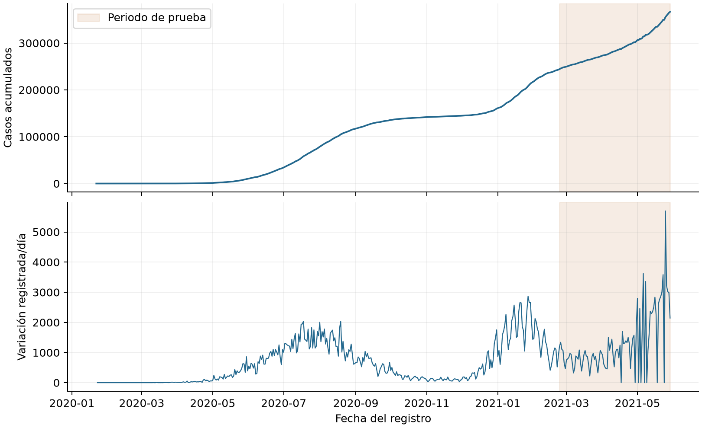
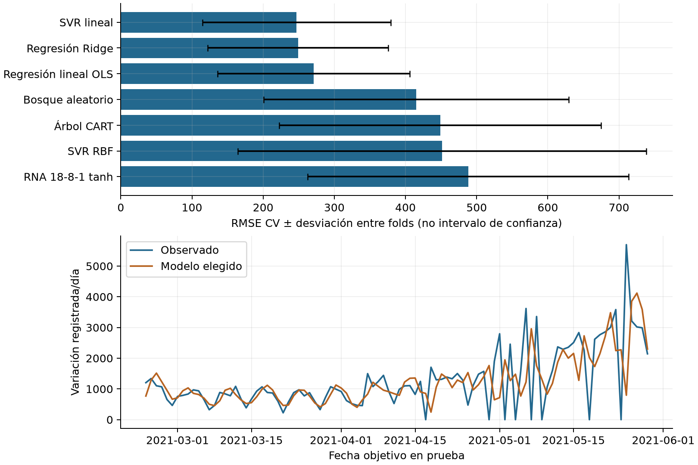

# Informe integrado de COVID: Bolivia

Grupo 15 · Machine Learning · Caso 04 · 30 de septiembre de 2026

## 1. Pregunta, integración y resultado principal

Este caso estudia si el historial de casos confirmados registrados en Bolivia permite estimar la variación del registro del día siguiente. Integra preparación, comparación de regresores, una red neuronal y evaluación temporal. Comparte infraestructura con el proyecto de vinos, pero tiene datos, respuesta, particiones e informe propios. No se mezclan unidades epidemiológicas con mediciones de vino.

El modelo elegido exclusivamente por validación fue SVR lineal, con RMSE medio 247.0342. En la prueba final obtuvo RMSE 939.3127 y MAE 546.0457. Estas cifras miden errores en la variación diaria registrada, no aciertos diagnósticos. La conclusión frente a referencias se desarrolla en la sección 7.

## 2. Fuente, estructura e integridad de los datos

El archivo aportado se llama time_series_covid_19_confirmed.csv. Su estructura coincide con las series globales JHU CSSE: provincia/estado, país/región, latitud, longitud y columnas por fecha. La documentación de series [1], apartado Time series summary, describe esa organización. No se comprobó igualdad byte por byte con una revisión remota ni se sustituyó el archivo del usuario.

El README JHU [2], apartado Terms of Use, atribuye el dataset a JHU CSSE y declara CC BY 4.0. La referencia bibliográfica solicitada allí es Dong, Du y Gardner (2020), DOI 10.1016/S1473-3099(20)30120-1. Las fuentes web no tienen paginación: se localizan por apartado. La licencia del dataset no se extiende al código o al informe del grupo.

| Descripción | Valor |
| --- | --- |
| Filas geográficas originales | 276 |
| Países/regiones etiquetados en el CSV | 193 |
| Fechas diarias | 494 |
| Periodo | 2020-01-22 a 2021-05-29 |
| Duplicados geográficos exactos eliminados | 0 |
| Filas originales utilizadas para el país | [27] |
| Acumulado final del país | 366714 |
| Revisiones diarias negativas en el país | 0 |
| Muestras supervisadas | 479 |

Huella SHA256 de los bytes del CSV: 0934296a198f159b98e486d9c2357ae72fd8dafcba7183ac148e823fe11e2a05. Esta huella identifica la copia efectiva, incluidos sus finales de línea. Cada fecha objetivo conserva además su posición original entre las columnas de fechas.

## 3. Preparación: del acumulado a una respuesta diaria

Se comprueban fechas consecutivas, valores acumulados enteros no negativos y ausencia de faltantes en los conteos. Un nombre de provincia vacío puede representar una fila nacional; no se imputa como una medición faltante. Se quitan únicamente filas geográficas completamente iguales, conservando la primera y su identificador. Filas de la misma provincia y país con valores distintos producen un error antes de agregar.

Sea C_t el acumulado del país en la fecha t. Primero se suman las filas correspondientes al país. Después se calcula d_t = C_t − C_(t−1). Esta diferencia es la respuesta diaria registrada. El primer día no tiene un antecedente y su diferencia queda indefinida; no se inventa un cero. Una diferencia negativa se conserva como revisión. La sección Data modification records de JHU [3] documenta cambios retrospectivos; esta lectura motiva distinguir registros e infecciones, pero la política de conservar las diferencias es nuestra decisión.

Para pronosticar d_t al cierre de t−1 se construyen 18 entradas: los 14 valores d_(t−1), …, d_(t−14); las medias de los últimos 7 y 14 días; y seno y coseno del día de semana objetivo. La media de 7 días suma d_(t−1) hasta d_(t−7) y divide entre 7. La ventana no está centrada y no contiene d_t. Para el calendario, k es el día de semana con lunes=0: se usan sen(2πk/7) y cos(2πk/7). La fecha futura es conocida al emitir el pronóstico y no aporta casos futuros.

Se excluyen 15 fechas iniciales por la diferencia indefinida y la necesidad de 14 antecedentes. Se conservan los ceros iniciales, los extremos y los días distintos con valores iguales. No se recorta ni redondea la respuesta. Estudiar la diferencia evita que una tendencia acumulativa suave domine la evaluación; no elimina por sí solo los cambios de régimen.



Figura 1. Acumulados y variaciones del registro; sombreado: periodo de prueba.

## 4. Protocolo temporal y control de información futura

Se reservaron las últimas 96 muestras para prueba: 2021-02-23 a 2021-05-29. Entrenamiento contiene 383 muestras, de 2020-02-06 a 2021-02-22. La cantidad de prueba se obtiene redondeando hacia arriba el 20 % de las muestras supervisadas. Esta fracción se fijó antes de calcular resultados y no depende de cuál modelo salga favorecido.

TimeSeriesSplit [4], apartado Parameters, implementa cortes ordenados y permite que el entrenamiento crezca. Elegimos cinco folds expansivos sin barajar. Toda fecha objetivo de ajuste precede a las de validación. Usamos gap=0 porque el horizonte es un día y d_(t−1) se conoce al pronosticar d_t; compartir historia entre ventanas no constituye por sí mismo fuga. Esa decisión no sería automáticamente válida para respuestas que agregaran varios días futuros.

| Fold | Ajuste: fechas (n) | Validación: fechas (n) |
| --- | --- | --- |
| 1 | 2020-02-06 a 2020-04-13 (68) | 2020-04-14 a 2020-06-15 (63) |
| 2 | 2020-02-06 a 2020-06-15 (131) | 2020-06-16 a 2020-08-17 (63) |
| 3 | 2020-02-06 a 2020-08-17 (194) | 2020-08-18 a 2020-10-19 (63) |
| 4 | 2020-02-06 a 2020-10-19 (257) | 2020-10-20 a 2020-12-21 (63) |
| 5 | 2020-02-06 a 2020-12-21 (320) | 2020-12-22 a 2021-02-22 (63) |

Cada fold aprende sus propias medias y escalas. StandardScaler se encuentra dentro del Pipeline para entradas de modelos lineales, SVR y RNA. Los árboles reciben entradas sin escalar. Todos los candidatos transforman y con StandardScaler mediante TransformedTargetRegressor [5], apartado Parameters: el modelo aprende en la escala transformada y la transformación inversa devuelve casos por día. Esa escala también se aprende únicamente con las respuestas de ajuste de cada fold.

Se selecciona la menor media de RMSE por fold; los empates exactos siguen el orden del catálogo. El elegido se reajusta con todo entrenamiento, manteniendo fijos sus parámetros en prueba. Para cada fecha de prueba se incorporan los registros reales ya observados hasta el día anterior. Esto evalúa predicciones sucesivas a un día, no una trayectoria de todo el periodo emitida desde un único origen. Solo el elegido y dos referencias fijadas se evalúan en prueba.

## 5. Modelos y relación con sus operaciones

OLS relaciona las entradas con una combinación lineal: b + Σ w_j x_j. b es el intercepto, w_j el coeficiente de la entrada j y la suma recorre las 18 entradas. Aprende minimizando la suma de errores cuadrados. Ridge añade alpha × Σ w_j² para penalizar coeficientes grandes. Se comparan alpha 0.1, 1, 10 y 100. Un coeficiente no representa un efecto causal de una intervención sanitaria.

CART divide entradas para reducir error cuadrático y predice la media de las respuestas de su hoja. Se prueban profundidades 3, 5 y sin límite, y mínimos de 5 o 15 muestras por hoja. El bosque promedia 160 árboles ajustados con remuestreo con reemplazo. Compara profundidad 8 o sin límite, hojas de 2 o 5 muestras y candidatos de variables 1.0 o sqrt. Estas grillas se heredaron del catálogo académico; no se presentan como óptimas para epidemiología.

SVR utiliza una tolerancia epsilon: los residuos dentro de ese margen no aportan pérdida epsilon-insensible. C controla la penalización de residuos que lo exceden. El kernel lineal representa una relación lineal; RBF permite relaciones no lineales mediante K(u,v) = exp(−gamma × ||u−v||²). u y v son vectores de entradas estandarizadas y gamma controla la caída de similitud con distancia. C y epsilon están en la escala de la respuesta estandarizada del fold, no en casos originales. Las grillas completas están en report.json.

La RNA fija tiene 18 entradas, 8 neuronas ocultas tanh y una salida lineal. Para una fila estandarizada u, calcula h = tanh(uW₁+b₁) y z = hW₂+b₂. W₁ tiene forma 18×8, b₁ contiene 8 sesgos, W₂ tiene forma 8×1 y b₂ un sesgo. Son 161 parámetros: 144+8+8+1. Si mu_y y s_y son la media y escala de la respuesta de ajuste, la predicción final es mu_y+s_y×z. La salida es continua y puede ser negativa.

La red utiliza L-BFGS, alpha=0.001, max_iter=2000, max_fun=50000 y semilla 42. Backpropagation calcula gradientes y L-BFGS actualiza parámetros con un método cuasi Newton. No es el SGD ni la red 11→8→1 del caso de vinos. Se fijó un único candidato neuronal antes de entrenar. Los 43 ajustes de hiperparámetros del catálogo previo más esta configuración suman 44 configuraciones en cinco folds.

## 6. Métricas y resultados de validación

Para n fechas evaluadas, y_i es la variación observada y ŷ_i la predicción. El residuo es r_i = y_i−ŷ_i. MAE promedia |r_i|; MSE promedia r_i²; RMSE es la raíz de MSE. MAE y RMSE se expresan en casos registrados por día, MSE en su cuadrado. R² compara la suma de errores cuadrados con la variación respecto a la media observada del conjunto evaluado: 1−Σr_i²/Σ(y_i−ȳ)². Puede ser negativo y queda indefinido si todas las respuestas son iguales.

| Modelo | RMSE CV | DE entre folds | MAE CV | Avisos |
| --- | --- | --- | --- | --- |
| SVR lineal | 247.0342 | 132.4231 | 191.6968 | 0 |
| Regresión Ridge | 249.1085 | 126.7409 | 194.9485 | 0 |
| Regresión lineal OLS | 271.0030 | 135.2726 | 210.2542 | 0 |
| Bosque aleatorio | 414.9517 | 214.2832 | 344.5572 | 0 |
| Árbol CART | 448.8468 | 226.1354 | 376.5138 | 0 |
| SVR RBF | 451.3410 | 287.0139 | 382.6404 | 0 |
| RNA 18-8-1 tanh | 488.1133 | 225.3845 | 392.5717 | 2 |

DE describe la dispersión de los cinco RMSE; no es un intervalo de confianza. Los folds corresponden a épocas distintas y sus errores no prueban superioridad estadística. Elegir entre configuraciones también puede favorecer la cifra de validación seleccionada; por eso la prueba se mantiene fuera de la elección.

| Referencia fija | RMSE CV | DE entre folds |
| --- | --- | --- |
| Persistencia de un día | 244.4203 | 122.1037 |
| Persistencia semanal | 282.2176 | 151.7141 |

Las referencias predicen d_(t−1) y d_(t−7), respectivamente. No necesitan entrenar ni escalar. Permiten comprobar si la complejidad adicional mejora reglas que aprovechan continuidad o calendario semanal. No participaron en la selección del candidato aprendido.

La persistencia de un día obtuvo RMSE CV 244.4203, frente a 247.0342 del modelo aprendido elegido. El RMSE de la referencia fue menor que el del candidato elegido en validación. El protocolo elige entre siete modelos aprendidos para contrastarlos con referencias; ese título de elegido no es una recomendación de despliegue ni afirma superar todas las referencias en todos los periodos.

## 7. Prueba reservada e interpretación

| Predictor | MAE | MSE | RMSE | R² |
| --- | --- | --- | --- | --- |
| SVR lineal | 546.0457 | 882308.3212 | 939.3127 | 0.1188 |
| Persistencia de un día | 695.3958 | 1528187.9792 | 1236.1990 | -0.5263 |
| Persistencia semanal | 584.4167 | 1047236.8542 | 1023.3459 | -0.0459 |

El RMSE de prueba es mayor que el de validación, lo que limita la transferencia entre periodos. Como ejemplo concreto, el 2021-05-25 el registro varió 5696 casos y el elegido predijo 796.10. Esa desviación contribuye al error cuadrático, pero el CSV por sí solo no permite atribuirla a un brote, retraso o corrección. La diferencia pequeña de validación entre Ridge y SVR lineal tampoco demuestra superioridad estadística del elegido.

El RMSE del modelo elegido es menor que el de persistencia de un día: 939.3127 frente a 1236.1990. Esta comparación describe el bloque reservado; no demuestra que la relación se mantenga en otra ola, otro país o una revisión distinta de los datos.

El RMSE del modelo elegido es menor que el de persistencia semanal: 939.3127 frente a 1023.3459. Esta comparación describe el bloque reservado; no demuestra que la relación se mantenga en otra ola, otro país o una revisión distinta de los datos.

El elegido produjo 0 predicciones negativas en prueba. Se conservaron sin recorte. El modelo estima una variación de registro y no impone una distribución de conteos. Para exigir salidas no negativas habría que definir otro experimento y reconocer que esta prueba ya fue observada.



Figura 2. RMSE de validación y comparación observada/predicha del elegido en prueba.

## 8. Parámetros elegidos y avisos de entrenamiento

| Modelo | Parámetros seleccionados |
| --- | --- |
| SVR lineal | {"regressor__model__C": 0.1, "regressor__model__epsilon": 0.1} |
| Regresión Ridge | {"regressor__model__alpha": 10.0} |
| Regresión lineal OLS | {} |
| Bosque aleatorio | {"regressor__model__max_depth": 8, "regressor__model__max_features": "sqrt", "regressor__model__min_samples_leaf": 2} |
| Árbol CART | {"regressor__model__max_depth": 5, "regressor__model__min_samples_leaf": 5} |
| SVR RBF | {"regressor__model__C": 10.0, "regressor__model__epsilon": 0.2, "regressor__model__gamma": 0.01} |
| RNA 18-8-1 tanh | {} |

Una grilla vacía corresponde a un candidato fijo; no significa que el estimador carezca de parámetros. El JSON conserva además estimator_parameters, los parámetros completos del estimador reajustado. fit_warnings contiene categoría y mensaje de los avisos capturados durante búsqueda y reajuste; su ausencia no constituye una demostración independiente de optimalidad.

RNA 18-8-1 tanh: 2 avisos (ConvergenceWarning). El registro informa que L-BFGS alcanzó el límite de 2000 iteraciones en 2 ajustes. No se confirmó convergencia en esos ajustes. Se conservaron configuración y mensajes originales en report.json; no se aumentó el límite después de observar la prueba. Los avisos capturados no identifican por separado el fold de origen.

## 9. Arquitectura y reproducción

PolarsCovidRepository valida y agrega la fuente. CovidPreprocessingService construye las entradas pasadas. build_temporal_split crea las ventanas cronológicas. covid_model_catalog reutiliza los seis modelos y añade la RNA. CovidExperimentService usa tune_model, compartido con vinos, para búsqueda y reajuste, y controla qué modelos acceden a prueba. La consola exporta series.csv, supervised.csv y report.json. El visor y este informe consumen evidencia persistida: no entrenan.

Desde la raíz del repositorio, con Python 3.12 o superior y uv:

```powershell
uv sync --locked --extra dev
uv run covid-quality preprocess
uv run covid-quality run
uv run python scripts/build_dashboard.py --report outputs/04_covid/report.json --output outputs/04_covid/results.html
```

El resultado histórico entregado ya existe: no es necesario repetir el entrenamiento para abrir el visor. La consola rechaza carpetas que ya contienen report.json. Para otra ejecución utiliza --output outputs/covid_nueva_ejecucion y declara la reutilización de prueba. --country permite otro nombre exacto del CSV, con resultados e interpretación propios.

Para reconstruir el Markdown, las figuras y el Word desde los resultados, instala el extra reports y ejecuta el generador:

```powershell
uv sync --locked --extra dev --extra reports
uv run --extra reports python scripts/build_covid_report.py
```

En equipos sin AVX2, añade --extra compat a sync y a run para usar el runtime compatible de Polars. No cambia las operaciones ni el protocolo; sigue fijada la misma versión de la biblioteca.

## 10. Evidencia de ejecución y límites

Las pruebas comprueban agregación y deduplicación geográfica, retardos, medias pasadas, revisiones negativas, fechas inválidas, cronología, escalado de X e y por fold, selección por validación y reconstrucción de métricas desde predicciones. Las pruebas de vinos permanecen en la suite. Los conteos y resultados de la revisión final se registran en CHANGELOG.md.

Versiones registradas: python 3.12.8; numpy 2.5.3; polars 1.44.2; scikit-learn 1.9.1. La evaluación registró 18.87 segundos en este equipo; es tiempo de evaluación y no incluye instalación, carga/exportación ni autoría del informe.

Los buffers de entradas ocupan 68976 bytes y los de respuesta 3832 bytes. Esto excluye tablas, objetos, copias, árboles y cachés; no representa el pico de RAM del proceso ni demuestra ahorro por usar Polars.

La copia termina en mayo de 2021 y no describe la situación actual. La cronología evita usar respuestas futuras al ajustar, pero no resuelve el problema de revisiones retrospectivas: faltan versiones del archivo tal como se publicaron cada día. Tampoco se incorporan población, cantidad de pruebas, vacunación, intervenciones o mortalidad. No se atribuyen causas ni se emiten recomendaciones sanitarias.

Este experimento sigue siendo regresión. Una matriz de confusión requiere una tarea y clases justificadas en otro protocolo. La primera prueba del caso 04 ya es conocida tras esta ejecución; cualquier ajuste posterior debe reconocerlo y buscar evidencia nueva para una evaluación confirmatoria.

## 11. Fuentes localizadas

[1] JHU CSSE. README de series temporales, apartado Time series summary. https://github.com/CSSEGISandData/COVID-19/blob/master/csse_covid_19_data/csse_covid_19_time_series/README.md

[2] JHU CSSE. README general, apartado Terms of Use. https://github.com/CSSEGISandData/COVID-19#terms-of-use

[3] JHU CSSE. README de datos, apartado Data modification records. https://github.com/CSSEGISandData/COVID-19/blob/master/csse_covid_19_data/README.md#data-modification-records

[4] scikit-learn. TimeSeriesSplit, descripción y Parameters. https://scikit-learn.org/stable/modules/generated/sklearn.model_selection.TimeSeriesSplit.html

[5] scikit-learn. TransformedTargetRegressor, descripción y Parameters. https://scikit-learn.org/stable/modules/generated/sklearn.compose.TransformedTargetRegressor.html

Consulta de fuentes: 30 de septiembre de 2026. Las elecciones de país, horizonte, entradas, grillas y prueba pertenecen al protocolo propio docs/decisions/004-covid-temporal.md.
